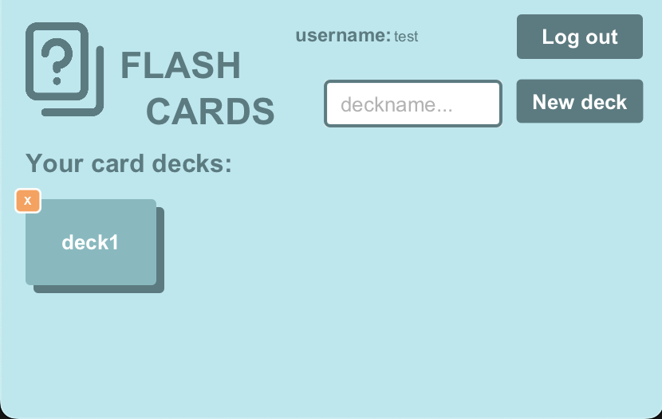
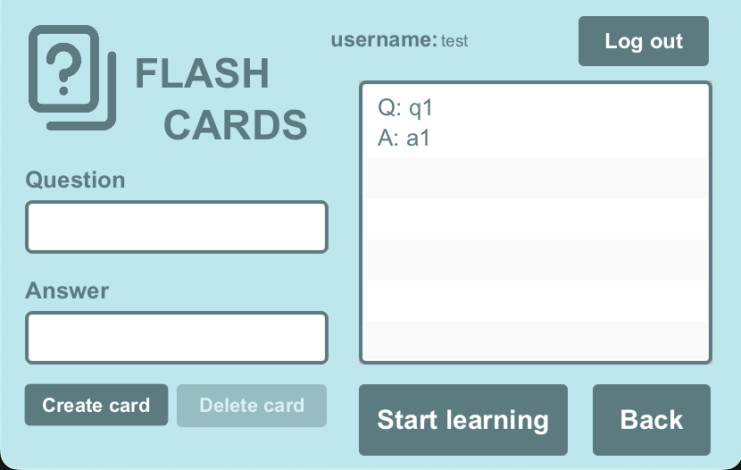
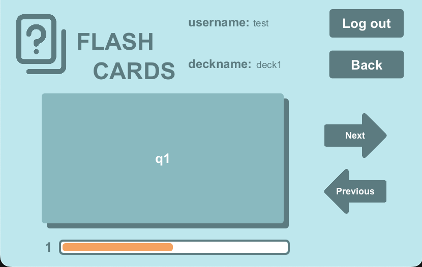
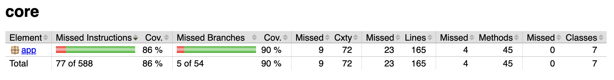
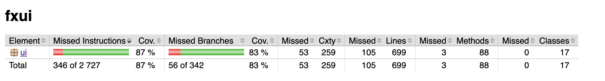
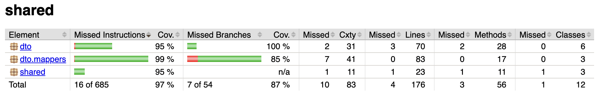
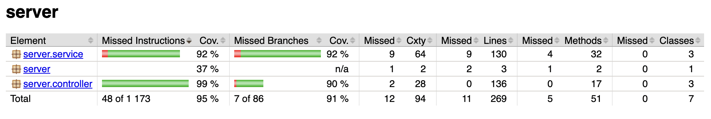
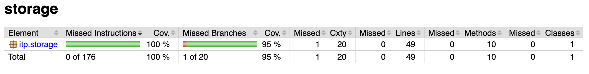

# Flashcards Application

[open in Eclipse Che](https://che.stud.ntnu.no/#https://git.ntnu.no/IT1901-2025-groups/gr2516.git)

## Overview

This repository contains a JavaFX application for creating and studying flashcards. Users can create profiles, organize flashcards into decks, and track their learning progress through an interactive study interface.

## Architecture

This application uses a **client-server architecture**:

- **Server** (`flashcards/server`): Spring Boot REST API backend (runs on port 8080)
- **Client** (`flashcards/fxui`): JavaFX desktop application

Both components must be running simultaneously for the application to work. The client communicates with the server via HTTP requests to the REST API.

## Quickstart

To quickly test the application:

1. Open the project folder

    ```bash
    cd flashcards
    ```

2. Install necessary dependencies while skipping tests

    ```bash
    mvn clean install -DskipTests
    ```

3. Open a new terminal

    **macOS**

    ```bash
    open -na Terminal
    ```

    **Windows (Command Prompt)**

    ```bash
   start cmd
    ```

    **Windows (PowerShell)**

    ```bash
    start powershell
    ```

    **Linux (GNOME Terminal)**

    ```bash
    gnome-terminal &
    ```

    **Linux (KDE Konsole)**

    ```bash
    konsole &
    ```

4. Open the `server` module in the new terminal

    ```bash
    cd server
    ```

5. Run the backend

    ```bash
    mvn spring-boot:run
    ```

6. While the backend is running, open the `fxui` module in the old terminal

    ```bash
    cd fxui
    ```

7. Run the app

    ```bash
    mvn javafx:run
    ```

**Note:** Both the server (step 5) and client (step 7) must be running simultaneously.

## Building the project

This project uses Maven for building and running.

To build all modules and run tests:

1. Navigate to the flashcards folder:

    ```bash
    cd flashcards
    ```

2. Build all modules:

    ```bash
    mvn clean install
    ```

## Running the application

### Method 1: Creating a shippable product

To create an executable file that runs locally on your computer:

1. If not already done, make sure to build the project

     ```bash
    mvn clean install
    ```

2. Open `fxui` module

    ```bash
        cd fxui
    ```

3. When in `fxui`, run this command to run and create a executable application

    ```bash
        mvn clean package javafx:jlink jpackage:jpackage
    ```

4. To be able to use the app, you must run the REST-API `server` in our app

    ```bash
        cd server
        mvn spring-boot:run
    ```

5. Now there has been created a Flashcards-1.0.0.dmg in `fxui/target/dist`. Locate this file and run that file.
6. You can now use the application on your computer

### Method 2: Maven

1. Open the project folder

    ```bash
    cd flashcards
    ```

2. Install necessary dependencies

    ```bash
    mvn clean install
    ```

3. Open a new terminal

    **macOS**

    ```bash
    open -na Terminal
    ```

    **Windows (Command Prompt)**

    ```bash
   start cmd
    ```

    **Windows (PowerShell)**

    ```bash
    start powershell
    ```

    **Linux (GNOME Terminal)**

    ```bash
    gnome-terminal &
    ```

    **Linux (KDE Konsole)**

    ```bash
    konsole &
    ```

4. Open the `server` module in the new terminal

    ```bash
    cd server
    ```

5. Run the backend

    ```bash
    mvn spring-boot:run
    ```

6. While the backend is running, navigate to the the `fxui` module in the old terminal

    ```bash
    cd fxui
    ```

7. Run the app

    ```bash
    mvn javafx:run
    ```

**Note:** Both the server (step 5) and client (step 7) must be running simultaneously for the application to work.

### Method 3: VS Code

Use the configured task "Run JavaFX App" from the VS Code command palette. **Important:** This task only starts the client, you must still run the server separately using `mvn spring-boot:run` in the `flashcards/server` directory.

## Code structure

This structure helps separate concerns and makes the project easy to navigate.

[flashcards](/flashcards/)

- [core](/flashcards/core/) - Business logic and domain models
- [fxui](/flashcards/fxui/) - JavaFX user interface and controllers
- [server](/flashcards/server/) - Spring Boot REST API backend service
- [shared](/flashcards/shared/) - Data Transfer Objects (DTOs), mappers, and shared API interfaces
- [storage](/flashcards/storage/) - JSON persistence and file handling
- [config](/flashcards/config/) - Code quality configuration files (Checkstyle, SpotBugs)
- [.vscode](/.vscode/) - VS Code workspace settings and tasks

## App design

**Login page:** initial window when opening the app, and opens when you click "Log out" on other pages


**Sign up page:** opens when you click "Sign up" on the Login page


**Main dashboard:** opens after clicking "Log in" or "Sign in", or when clicking "back" on the deck management page


**Deck management:** opens when clicking a deck on the main dashboard, or when clicking "back" on the learning page


**Learning page:** opens when clicking "Start learning" om the deck management page


## Dependencies

- Java version 21
- JavaFX version 21
- Maven version 3.9+
- JUnit 5 (Jupiter) for testing
- TestFX for UI testing
- SpotBugs 4.9.3.0 for static analysis
- Checkstyle for code style enforcement
- Jackson for JSON processing

## Test coverage

After running `mvn test`, you can generate test coverage reports via JaCoCo:

1. Navigate to a specific module (core, fxui, server, shared, storage)

    ```bash
    cd XXX
    ```

2. Generate the JaCoCo report by running:

   ```bash
   mvn jacoco:report
   ```

3. Open the HTML report to show JaCoCo coverage, from the module you ran tests for:

    ```bash
    open target/site/jacoco/index.html
    ```

**Current test coverage:**

- **core**: Instruction Coverage: 86% | Branch Coverage: 90%
- **fxui**: Instruction Coverage: 87% | Branch Coverage: 84%
- **shared**: Instruction Coverage: 97% | Branch Coverage: 87%
- **server**: Instruction Coverage: 95% | Branch Coverage: 91%
- **storage**: Instruction Coverage: 100% | Branch Coverage: 95%







Current coverage targets focus on core business logic and critical user workflows.

## Coding standards

We maintain high coding standards using:

- **SpotBugs**: Static analysis for bug detection (`mvn spotbugs:check`)
- **Checkstyle**: Code style enforcement following Google Java Style (`mvn checkstyle:check`)
- **Comprehensive Javadoc**: All public classes and methods are documented
- **Consistent naming**: Following Java conventions for classes, methods, and variables

To check code quality: `mvn verify` (runs tests, SpotBugs, and Checkstyle)

## Documentation

For detailed project documentation, navigate to [docs](/docs/):

- [Release 1](/docs/release_1/) - Initial implementation and basic functionality
- [Release 2](/docs/release_2/) - Enhanced features, user authentication, and quality improvements
- [Release 3](/docs/release_3/) - Enhanced features, implementation of API in server and shared module and improved user authentication

## Use of AI

As part of this project, we made use of AI-based tools to improve development efficiency and code quality. For detailed information about our AI usage, see [AI Tools documentation](/docs/release_3/ai_tools.md).

## Getting started

See the ["Building the project"](#building-the-project) and ["Running the application"](#running-the-application) sections above for setup instructions. If you want a quick run through, see the ["Quickstart"](#quickstart) section. For development, ensure you have Java 21 and Maven installed.
