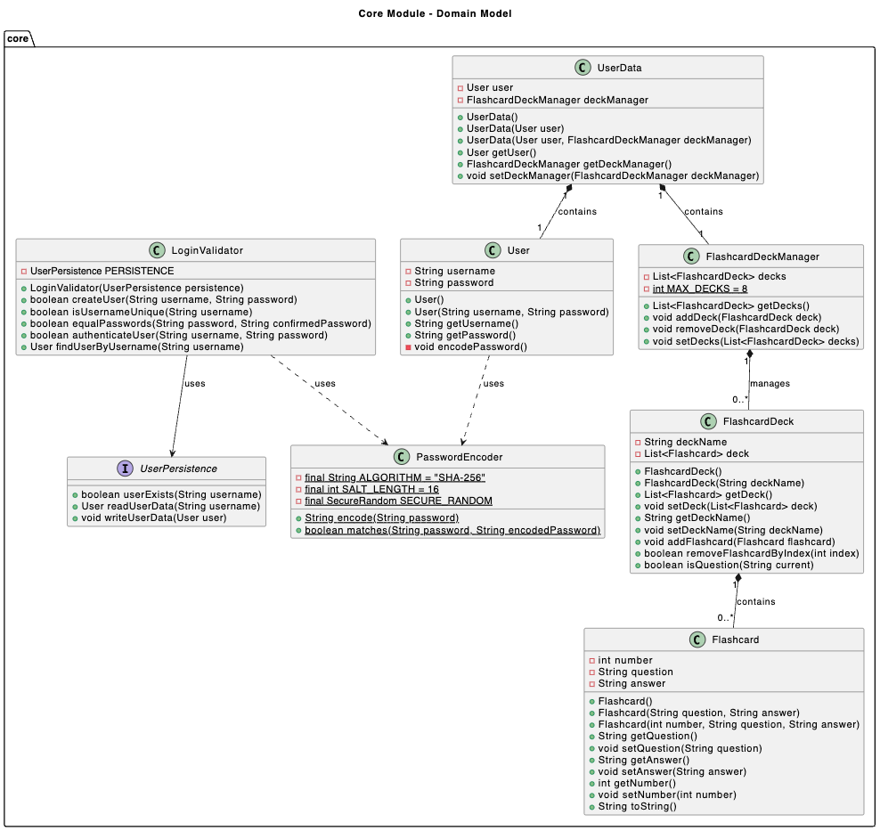
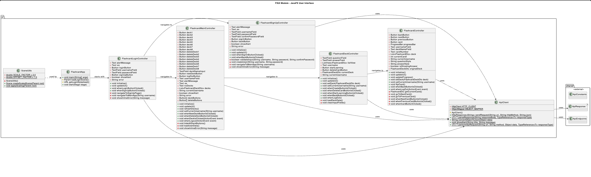
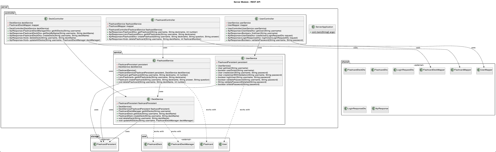
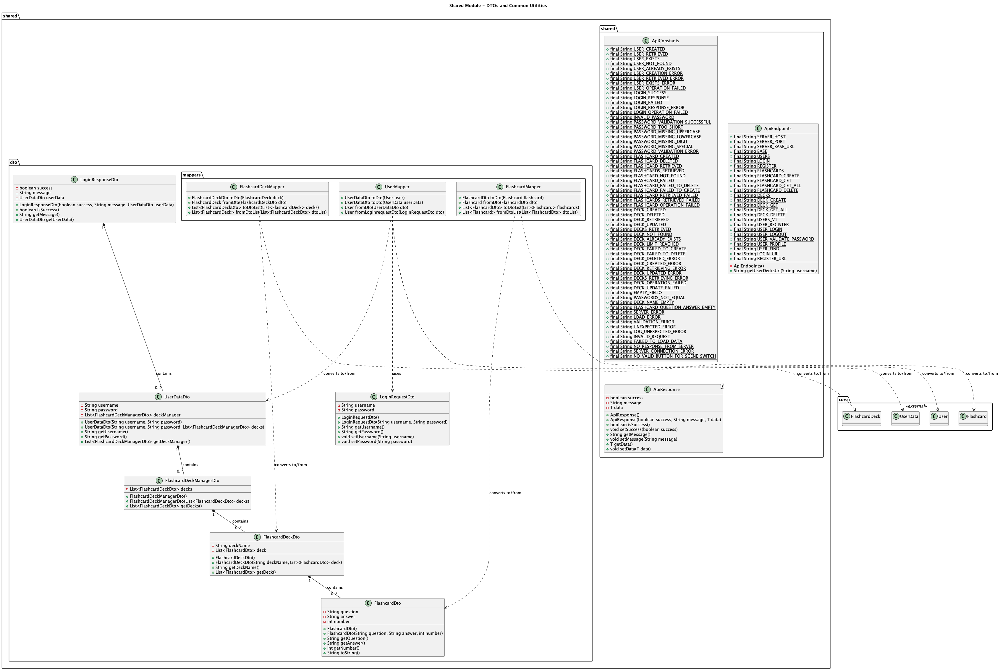
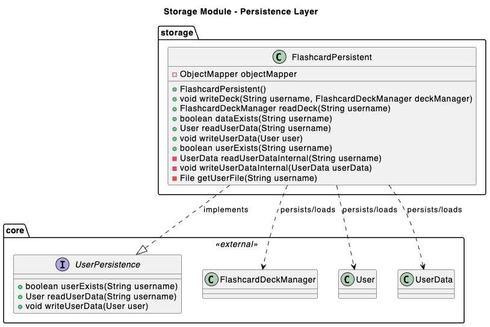
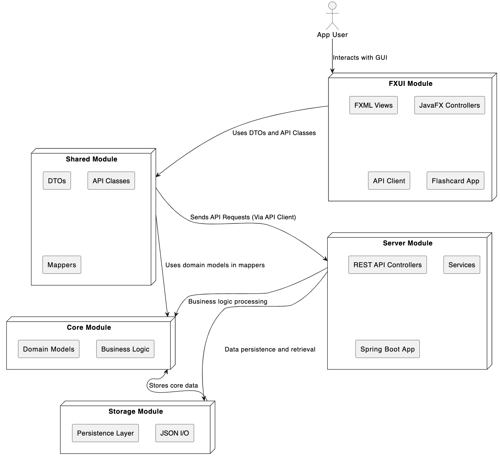
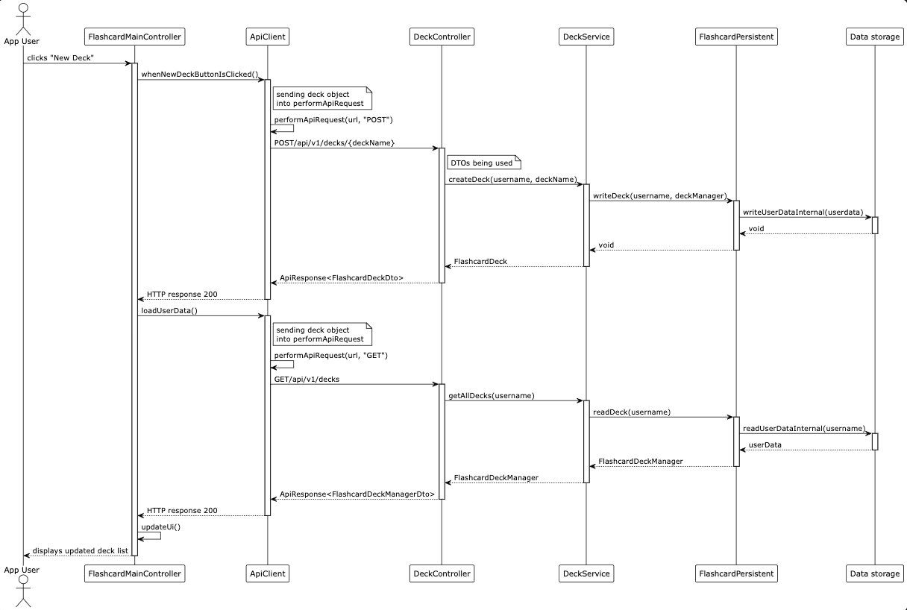
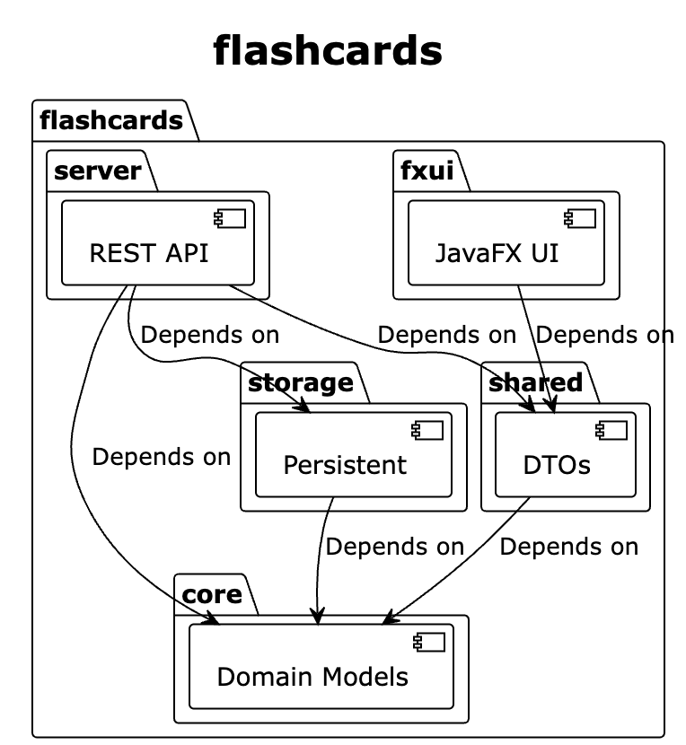

# Release 3

In this third milestone, our primary goal was to transform the application into a modern client-server architecture with a REST API backend and enhanced authentication system. The milestone introduces a Spring Boot REST API server, comprehensive user registration and login system with secure password handling, and seamless client-server communication. These enhancements establish a scalable, production-ready platform that separates concerns between the JavaFX client and the backend services.

## User stories

The application addresses these key user needs:

- As a user, I want to log into the application in a secure way, so that I am assured that no one else has access to my password and my flashcards
- As a user, I want to register as a new user, so that I can start using the application and save flashcards that I can use later

## Key Focus Areas

### 1. REST API Architecture

We implemented a comprehensive Spring Boot REST API that serves as the backend for all application functionality.
The API provides endpoints for user management, authentication, deck operations, and flashcard manipulation.
All API responses follow a standardized `ApiResponse<T>` format for consistent error handling and data transfer.
The server implements proper HTTP status codes and follows RESTful conventions for predictable and maintainable endpoints.

### 2. Secure Authentication System

Developed a robust authentication system with user registration and login capabilities.
Implemented SHA-256 password hashing with unique salt generation to ensure secure password storage.
Added comprehensive password validation requiring uppercase, lowercase, numbers, and special characters.
Created seamless integration between the JavaFX client and authentication endpoints with proper error handling.

### 3. Client-Server Communication

Built a sophisticated HTTP client (`ApiClient`) that handles all communication between the JavaFX application and the REST API.
Implemented type-safe request/response handling with proper JSON serialization and deserialization.
Added comprehensive error handling for network issues, server errors, and data validation problems.
Created Data Transfer Objects (DTOs) to maintain clean separation between client and server data models.

## Project Module Separation

The project has been expanded to a five-module architecture for better separation of concerns:

**[fxui (flashcards/fxui)](../flashcards/fxui):**  
This module handles all JavaFX user interface components and controllers, now including REST API client functionality.

**[core (flashcards/core)](../flashcards/core):**  
This module contains the business logic and domain models for flashcards, decks, and user authentication.

**[storage (flashcards/storage)](../flashcards/storage):**  
This module is responsible for JSON persistence and file-based data management on the server side.

**[server (flashcards/server)](../flashcards/server):**  
This new module contains the Spring Boot REST API server with controllers, services, and API endpoints.

**[shared (flashcards/shared)](../flashcards/shared):**  
This new module contains shared DTOs, constants, and utilities used by both client and server modules.

## Authentication Implementation

We implemented a comprehensive authentication system that enhances security and user experience.
The system includes user registration with username uniqueness validation and password strength enforcement.
Login functionality validates credentials against securely hashed passwords stored on the server.
The client maintains session state by storing the current username and propagating it throughout the application.
All password handling uses secure practices including salt generation and SHA-256 hashing to prevent common attacks.

## REST API Design

The REST API follows established conventions with resource-based URLs and proper HTTP method usage. All endpoints are versioned through the `/api/v1/` prefix for future compatibility. The API implements comprehensive input validation and error handling to ensure data integrity and security.

Endpoints are organized by functionality:

- `/api/v1/users` - User management, authentication, and registration
- `/api/v1/decks` - Deck creation, deletion, and management
- `/api/v1/flashcards` - Flashcard operations within decks

All responses use a standardized `ApiResponse<T>` format that includes success status, descriptive messages, and typed data payloads. The API uses proper HTTP methods (GET, POST, PUT, DELETE) and implements comprehensive error handling with informative messages that don't leak sensitive information.

For detailed documentation of all endpoints including request/response formats, parameters, and examples, see the [REST API Documentation](rest_api.md).

## Development Process

Our development approach continued to emphasize pair programming and regular communication, as detailed in our [Teamwork](teamwork.md) documentation. We made extensive use of AI tools for REST API development and debugging, as outlined in our [AI Tools](ai_tools.md) report.

## Code Quality Report

As of this release, the project maintains high code quality standards through enhanced tools and practices. For detailed information about our code quality approach, see our [Code Quality](code_quality.md) documentation.

Key quality measures include:

- Comprehensive Javadoc documentation for all controllers, services, and DTOs
- SpotBugs static analysis with enhanced focus on REST API security
- Checkstyle compliance following Google Java Style guidelines across all modules
- Extensive unit and integration testing for both client and server components
- JaCoCo test coverage reporting with module-specific coverage goals
- Enhanced UML documentation reflecting the client-server architecture

## Security Enhancements

- Secure password hashing using SHA-256 with random salt generation
- Input validation at multiple layers to prevent injection attacks
- Proper error handling that doesn't leak sensitive information
- Password complexity requirements enforced on both client and server
- Secure HTTP client implementation with proper exception handling

## Further improvements

- Implement session management with JWT tokens for enhanced security
- Add API rate limiting and request throttling for production deployment
- Implement database persistence to replace file-based storage
- Add comprehensive API documentation with OpenAPI/Swagger
- Implement advanced error recovery and retry mechanisms
- Add logging and monitoring for production environments

For the current release, the application provides a robust, scalable foundation with modern architecture patterns that support future enhancements such as multi-device synchronization, advanced analytics, and enterprise-level deployment scenarios.

## UML diagrams

[UML diagrams](uml_documentation)

The UML documentation provides comprehensive visual representations of the application's structure and behavior through various diagrams. These diagrams illustrate how the different modules interact, how data flows through the system, and how the classes are organized within each module.

### Class diagrams

Due to the extensive number of classes across the project, we have organized the class diagrams by module to provide clear, focused views of each architectural layer. Each diagram shows the classes, their attributes and methods, and the relationships between them within that specific module.

The class diagrams follow UML conventions where `green cicle` indicates public visibility, `red square` indicates private visibility, and `red filled square` indicates protected visibility. Solid arrows show dependencies and associations, while dashed arrows show interface implementations or usage relationships.

**core**

The core module contains the fundamental domain models including `Flashcard`, `FlashcardDeck`, `FlashcardDeckManager`, and authentication-related classes like `User`, `UserData`, `LoginValidator`, and `PasswordEncoder`.

**fxui**

The fxui module shows all JavaFX controllers and the `ApiClient` that handles REST API communication. This includes controllers for login, signup, main view, deck management, and flashcard learning.

**server**

The server module illustrates the Spring Boot REST API structure with controllers (`UserController`, `DeckController`, `FlashcardController`) and services (`UserService`, `DeckService`, `FlashcardService`) that implement the business logic.

**shared**

The shared module contains all Data Transfer Objects (DTOs) used for client-server communication, mapper classes for converting between domain objects and DTOs, and API constants and endpoints.

**storage**

The storage module shows the `FlashcardPersistent` class which implements the `UserPersistence` interface and handles JSON-based file storage for user data and flashcards.

### Architecture diagram

The architecture diagram provides a high-level overview of the system's structure, showing how the five modules (core, fxui, server, shared, storage) interact with each other. It illustrates the client-server separation, with the JavaFX client communicating with the Spring Boot server via REST API, and the server using the storage layer for data persistence.

### Sequence diagram

**User story:** As a user I, want to create a new deck so that I can start creating flashcards for a new topic.

The sequence diagram illustrates the process that occurs when a user creates a new deck in the application. It shows the chronological order of method calls between objects across different layers of the system:
The JavaFX controller initiates a request through the ApiClient, which communicates with the REST API (DeckController). The API then uses the DeckService and FlashcardPersistent components to store the new deck in the underlying data storage. Finally, the updated list of decks is retrieved and returned to the client so the user interface can be refreshed.

We deliberately chose not to include an alt (alternative flow) section in our sequence diagram. The purpose of this diagram is to clearly illustrate the main success scenario of the user story, the process of successfully creating a new deck. Including alternative or error-handling paths would have made the diagram significantly more complex and harder to read. Therefore we prioritized a simplified view. The alternative cases (such as failed API calls or invalid input) are still handled in the actual implementation and corresponding test cases but are not shown here to keep the diagram focused and easy to interpret.

### Package diagram

The package diagram shows the dependencies between the five main modules of the application. It clearly illustrates how the modules depend on each other, with the shared module being used by both client (fxui) and server modules, the server depending on core, storage, and shared, and the clean separation of concerns enforced by this multi-module architecture.